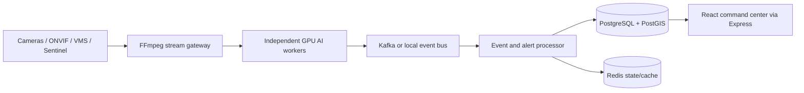

# NETRAX

**AI-POWERED CCTV INTEGRATION & VIDEO ANALYTICS**

NetraX is a security-conscious prototype for CCTV registry, GIS, server-side RTSP ingestion, YOLO/ByteTrack analytics, evidence snapshots, ANPR/OCR adapters, vehicle journeys, watchlists, alerts, and operator dashboards. It targets an approximately **80,000-camera architecture**; this laptop does not process 80,000 live streams.

## Quick start

Copy `backend/.env.example` to `backend/.env`, configure PostgreSQL, and apply `database/schema.sql`, the existing migrations, and `database/platform_migration.sql`. Then run `npm install && npm start` in `backend/`, and `npm install && npm run dev` in `frontend/`.

The AI service is optional for the dashboard. Install `ai-service/requirements.txt`, ensure FFmpeg and the YOLO model exist, configure its environment, and run `python ai_live.py`. `MAX_CAMERAS=0` means all eligible persisted cameras. RTSP is server-side over TCP; browsers use HLS/WebRTC when configured.

## Architecture



See [docs/ARCHITECTURE.md](docs/ARCHITECTURE.md), [docs/SCALABILITY.md](docs/SCALABILITY.md), [docs/API.md](docs/API.md), and [docs/DEMO.md](docs/DEMO.md). ANPR is disabled by default and never invents plates. Speed is review-only and requires calibration and PTS timestamps. Government integrations are adapters, not connected databases.

## Verification

```bash
curl http://localhost:5001/api/health
curl http://localhost:5001/api/cameras
curl http://localhost:5001/api/detections
python3 tools/scale_test.py --cameras 80000
(cd frontend && npm run build && npm run lint)
(cd backend && npm run check)
python3 -m py_compile ai-service/*.py tools/*.py

## Cloud deployment

Deploy the backend and frontend as separate services (Railway, or an equivalent
platform) and attach a managed PostgreSQL/PostGIS-compatible database. The
backend runs with `npm start`; set `DATABASE_URL`, `DATABASE_SSL=true` when
required by the provider, `PORT`, `CORS_ORIGIN` to the exact frontend URL, and
the remaining values documented in `backend/.env.example`. Apply the SQL files
in the documented order before first use. Build the frontend with `npm run
build` and set `VITE_API_URL` to the public backend URL at build time. Verify
`GET /api/health`, `GET /api/system/status`, and `GET /api/cameras` after
deployment. Sentinel media remains an external authenticated dependency; its
credentials must never be placed in frontend source or public environment
variables.
```

Docker provides the architectural local services; native development remains supported for the Camera 13 fixture. Never commit `.env`, credentials, private camera URLs, snapshots, logs, or model artifacts.

## Limitations

HLS/WebRTC playback requires a configured gateway; RTSP is intentionally not browser-playable. Kafka/Redis are integration architecture in this prototype. OCR requires a configured plate model and OCR engine. Enforcement, legal fines, identity matching, and government watchlists require authorized integrations and human review.
